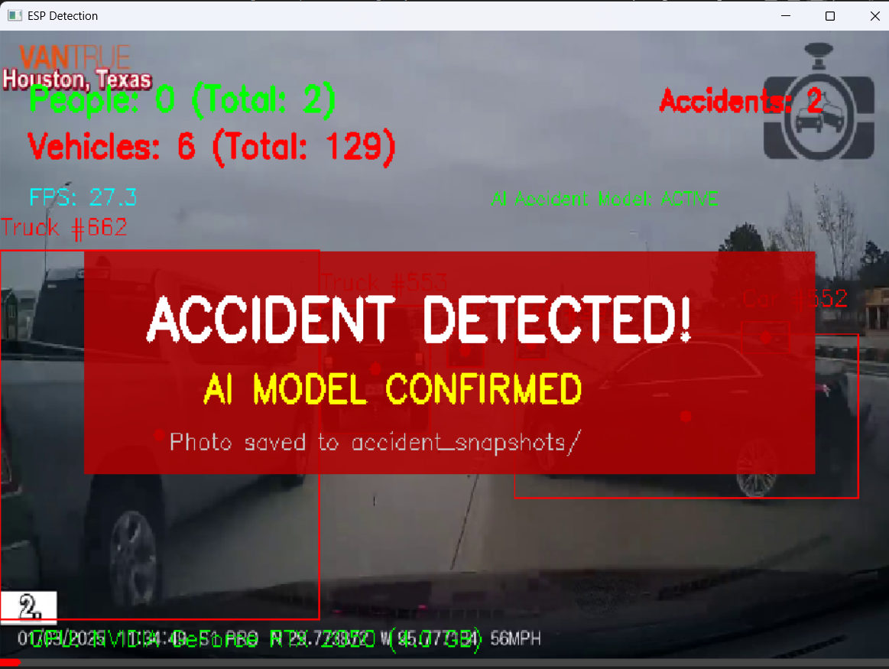
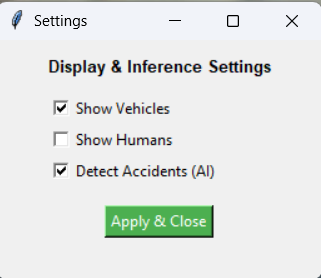
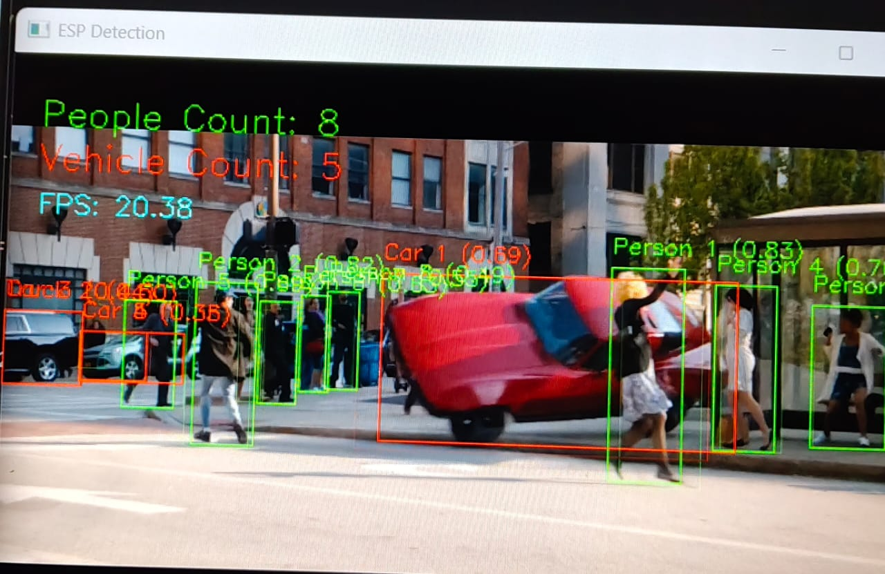
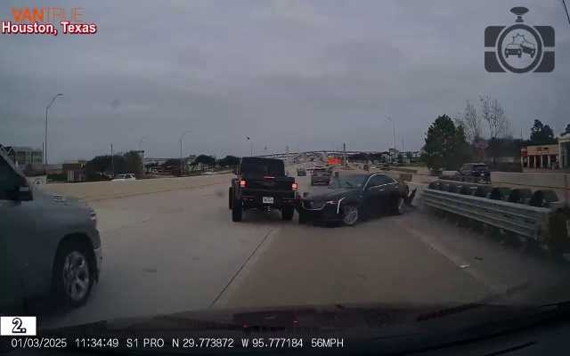
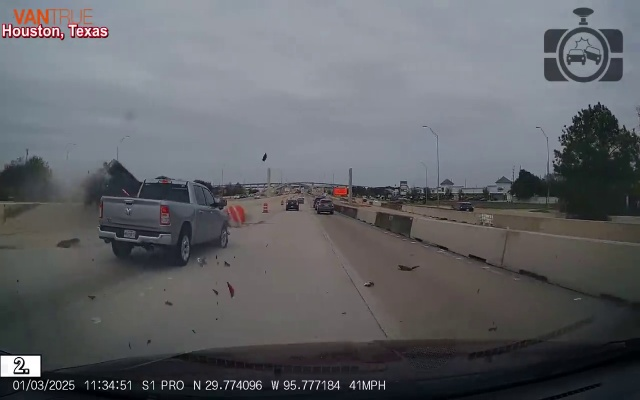
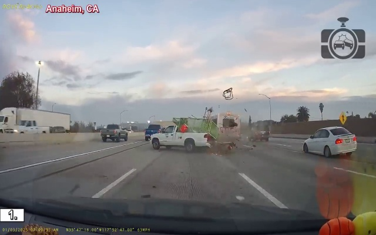

# Accident Detection and Alert System

Welcome to the **Accident Detection and Alert System**. This project uses advanced AI and computer vision (YOLOv8) to detect traffic accidents in real-time, monitor vehicle interactions, and provide accurate alert snapshots.

## Project Snapshots & Demos

Below are some previews and action shots of the system continuously tracking and detecting events.

### System Interfaces & Usage

### Real-Time Detections & Counting

### Auto-Generated Accident Alerts

When an accident is captured, the system automatically takes high-confidence snapshots of the event:

## Features
- **Real-Time Detection:** Rapidly identify crashes from incoming video feeds.
- **Bounding Box Tracking:** Detailed object tracking using YOLOv8, separating humans and vehicles.
- **Precision Validation:** Confidence checks and IoU intersection math minimize false-positive alerts.
- **Video & Stream Support:** Analyze pre-recorded video files (mp4) or live CCTV feeds directly.
